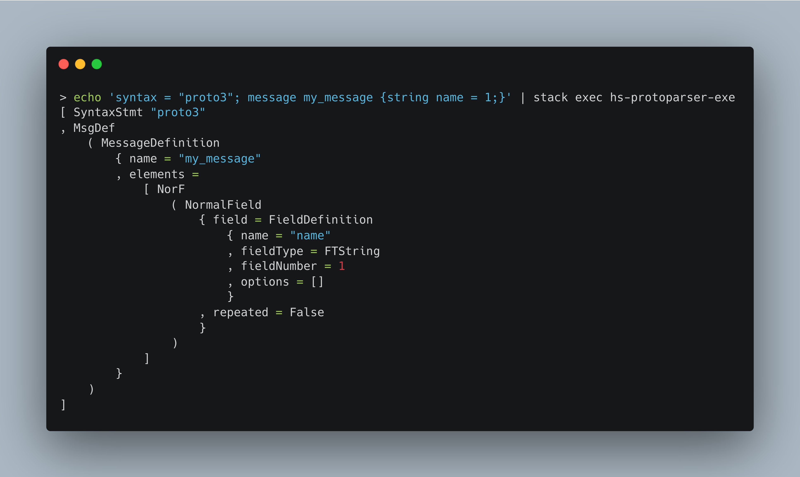

# hs-protoparser

Parser for Protocol Buffer files written in Haskell.



# Installation

If you are using stack you can add the package as an `extra-dep`:

```sh
extra-deps:
  - git: https://github.com/pabloariasal/hs-protoparser.git
    commit: ...
```

# Usage

Import the `Parser` module and call `parseProto`, providing the contents to be parsed.
For example, the following program prints the number of messages defined in the protocol buffer file:

```haskell
import HSProtoParser.Parser (parseProto)
import HSProtoParser.Ast
import System.Exit

main = do
    f <- readFile "example.proto"
    case parseProto "example.proto" f of
        Left e -> putStr e >> exitFailure
        Right t -> putStr show (getMessages t) >> exitSuccess

getMessages :: ProtoFile -> [String]
getMessages = foldr f []
  where
    f (MsgDef (MessageDefinition n _)) acc = n:acc
    f _ acc = acc
```
